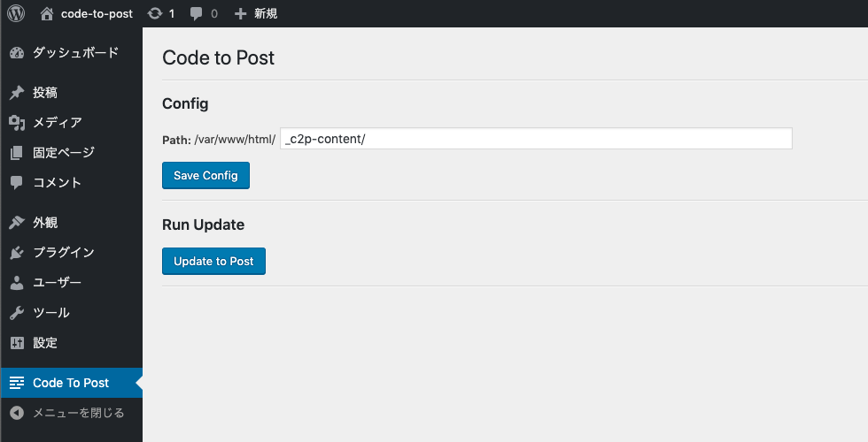
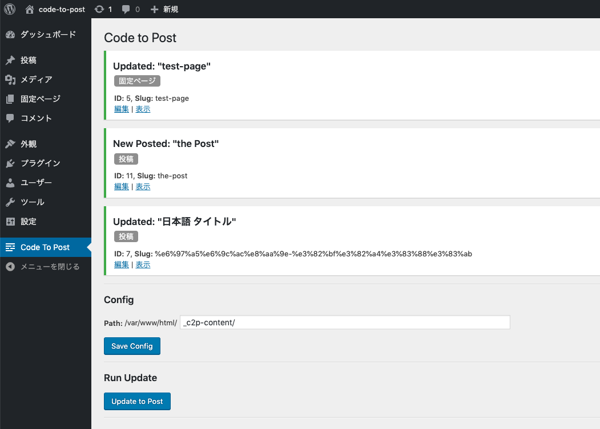

Code To Post - WordPress Plugin
====
## ⚠️ This plugin in development

---

 https://wordpress.org/plugins/code-to-post/

- HTMLファイルから postの作成/更新
- 固定ページ・カスタムポスト対応
- ディレクトリ名を post typeとして読み込み
- ファイル名を post name (Slug)として読み込み
- アップデートするのは `post_content`のみ
- 階層構造をもつpostは親slugのディレクトリに

## Screenshot






## Directory Example
```
my-posts-dir
    ├── post
    │  ├── hello.html
    │  └── any-slug.html
    │
    ├── page
    │  ├── about.html
    │  ├── searvice.html
    │  └── searvice
    │        ├── searvice-child-01.html
    │        └── searvice-child-02.html
    │
    └── my-custom-post
        ├── custom-post-01.html
        └── custom-post-02.html
```
