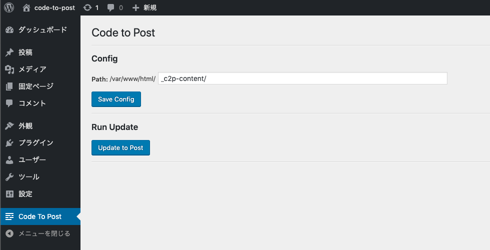
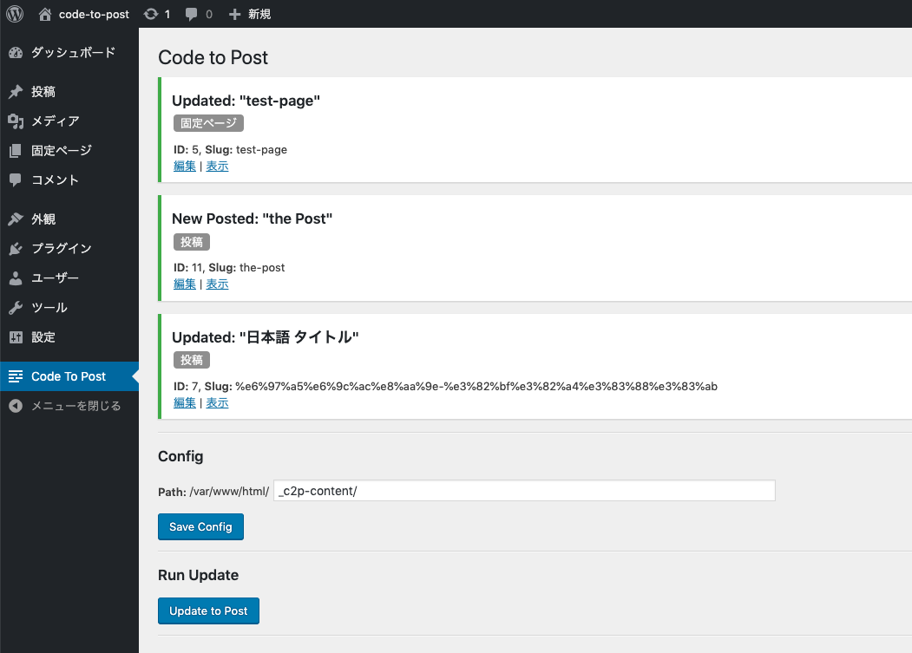

Code To Post - WordPress Plugin
====
## ⚠️ This plugin in development

---

- HTMLファイルから postの作成/更新
- 固定ページ・カスタムポスト対応
- ディレクトリ名を Post typeとして読み込み
- ファイル名を Post name (Slug)として読み込み
- アップデートするのは `post_content`のみ

## Screenshot







## Directory Example
```
my-posts-dir
　　┣ post
　　┃　┣ hello.html
　　┃　┗ any-slug.html
　　┃
　　┣ page
　　┃　┣ about.html
　　┃　┗ searvice.html
　　┃
　　┗ my-custom-post
　　 　┣ post-01.html
 　　　┗ post-02.html
　
```
